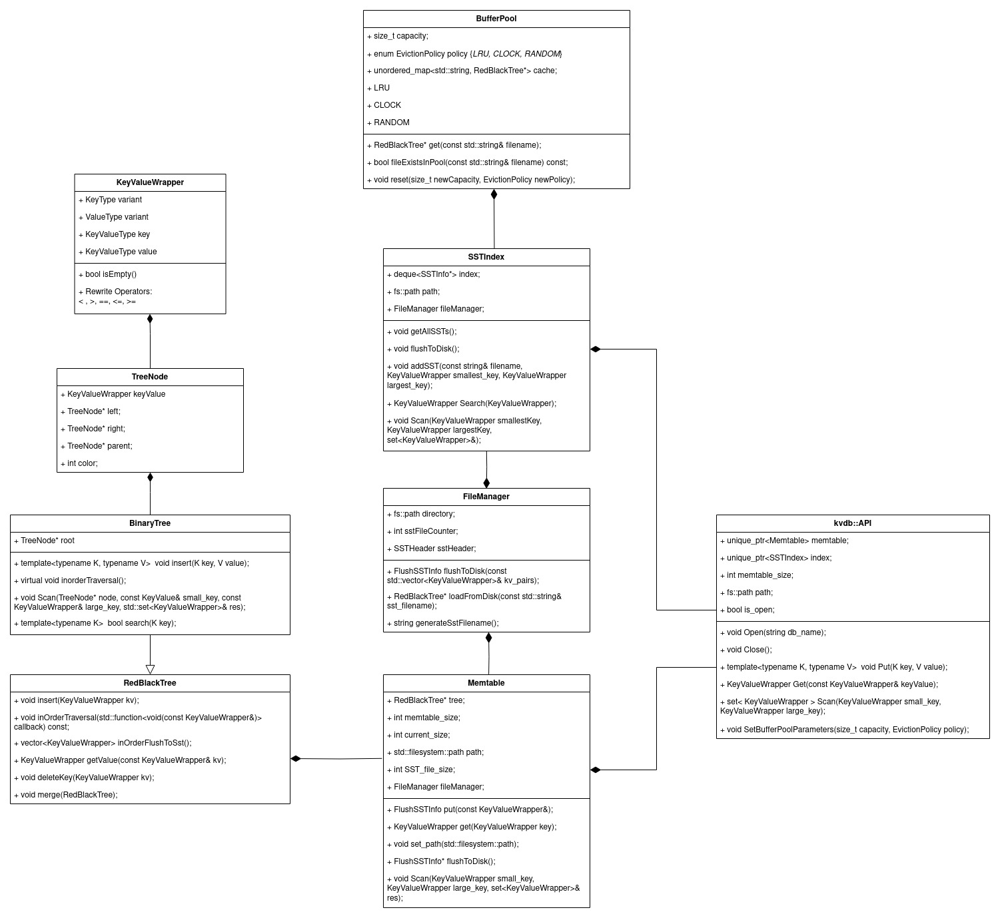

## VeloxDB

VeloxDB is a persistent key-value store database library. It designed to store 
key-value pairs and allow efficient retrieval based on the key. This system is 
inspired by modern databases like [LevelDB](https://github.com/google/leveldb) 
and [RocksDB](https://github.com/facebook/rocksdb), and supports multiple data 
types using C++ Templates and Protocol Buffers.

## Operations

#### **VeloxDB::Open(string db_name)**
Initializes the database system, setting up the necessary files and directories (including SSTs and related data). Can be initialized with a custom Memtable size or default size of `1e4`.

```c++
/*
 *  Initialize with default value : 
 *       Memtable::size == 1e3
 *       SsTFileManager::DiskBTree::Degree == 3
 */ 
auto MyDBDefault = std::make_unique<VeloxDB>();
auto MyDBDefault = std::make_unique<VeloxDB>(int memtableSize, int BTreeDegree);

MyDBDefault->Open("database_name");
```

#### **VeloxDB::Close()**
Closes the database, flushing any data in memory (Memtable) to disk and storing it in SSTs.

```c++
// Close the database and flush the Memtable to disk
auto MyDB = std::make_unique<VeloxDB>();
MyDB->Open("database_name");
MyDB->Close();
```


#### **Template<typename K, typename V> VeloxDB::Put(K key, V value)**
Inserts a key-value pair into the database, where both the key and value can be of various types (int, double, string, etc.).

```c++
// Example of inserting different data types
auto MyDB = std::make_unique<VeloxDB>();
MyDB->Open("database_name");
MyDB->Put(1, 100);             // int -> int
MyDB->Put(1.5, 'A');           // double -> char
MyDB->Put("Hello", 1e8LL);     // string -> long long
```

#### **VeloxDB::Get(const KeyValueWrapper& key)**
Retrieves a value from the database based on the key. Supports multiple data types.

```c++
// Example of retrieving values
auto MyDB = std::make_unique<VeloxDB>();
MyDB->Open("database_name");
MyDB->Put(1, 100);
MyDB->Put(1.5, 'A');
MyDB->Put("Hello", 1e8LL);

// Retrieve the value by key
auto result1 = MyDB->Get("Hello");
long long value1 = result1.kv.long_value(); // 1e8
string key1 = result1.kv.string_key(); // "Hello"

// Retrieve the value by `KeyValueWrapper` instance
auto result1 = MyDB->Get(KeyValueWrapper("Hello", "")); 
// Expected result1: { key: "Hello", value: 1e8LL }
long long value1 = result1.kv.long_value(); // 1e8
string key1 = result1.kv.string_key(); // "Hello"

// e.g.2
auto result2 = MyDB->Get(1);
int value2 = result2.kv.int_value();
int key2 = results.kv.int_key();
```

#### **VeloxDB::Scan(KeyValueWrapper smallestKey, KeyValueWrapper largestKey)**
Scans the database for key-value pairs within a specified key range. The results are returned in sorted key order.

```c++
// Scan for key-value pairs within a range
auto MyDB = std::make_unique<VeloxDB>();
MyDB->Open("database_name");
// Scan by key
std::set<KeyValueWrapper> results = MyDB->Scan(1, 10);
// Scan by `KeyValueWrapper` instance
std::set<KeyValueWrapper> results = MyDB->Scan(KeyValueWrapper(1, ""), KeyValueWrapper(10, ""));
```

#### **VeloxDB::Update(KeyValueWrapper KeyToUpdate)** (TBA)
This will allow the updating of key-value pairs within the database.

#### **VeloxDB::Delete(KeyValueWrapper Key)** (TBA)
This will allow the deletion of key-value pairs from the database.

### SST Files Layout
```
[Internal Node Page (Root)]
[Internal Node Page 1]
[Internal Node Page 2]
...
[Internal Node Page n]
[Leaf Node Page 1]
[Leaf Node Page 2]
[Leaf Node Page 3]
...
[Leaf Node Page m]
[* Clustered Index Page]
[* Bloom Filter Page]
[SST Metadata Page]
```
#### `Page::PageSize`
> Page with `PageSize::` **PageSize** (`4KB`, `8KB`)

#### `Page::SST_MetaData`
```c++
LeafNode_Begin_Offset
LeafNode_End_offset
FileName
```

#### `Page::LeafNodes`
```c++
/*
 *  4kb / 8kb chunk
 *  sorted by key
 */
serialized key-value pair 1 metadata (serialized by protobuf)
serialized key-value pair 2 metadata (serialized by protobuf)
serialized key-value pair 3 metadata (serialized by protobuf)
...
// with padding
```

#### `Page::InternalNodes`
```c++
/*
 *  4kb / 8kb chunk
 *  sorted by level
 */
level#0 key-value pair 0 metadata (serialized by protobuf), jump_offset_L1_K0, jump_offset_L1_K1
level#1 key-value pair 1 metadata (serialized by protobuf), jump_offset_L2_K0, jump_offset_L2_K1
level#1 key-value pair 2 metadata (serialized by protobuf), jump_offset_L2_K1, jump_offset_L2_K2
...
// with padding
```

#### `Page::BloomFilter`
TBD
#### `Page::ClusteredIndex`
TBD

### Supported Data Types
> 2024-09-12 Restructure with `Protobuf`

> 2024-09-09 Support Template<typename K, typename V>
```c++
enum KeyValueType { INT, LONG, DOUBLE, CHAR, STRING };
```

> 2024-08-28 Support <int_64, int_64>
> 


> Using **Protocol Buffer** for data serialization

```protobuf
syntax = "proto3";
message KeyValue {
  oneof key {
    int32 int_key = 1;
    int64 long_key = 2;
    double double_key = 3;
    string string_key = 4;
    string char_key = 5;  // Protobuf doesn't have a char type,  use a single-character string
  }

  oneof value {
    int32 int_value = 6;
    int64 long_value = 7;
    double double_value = 8;
    string string_value = 9;
    string char_value = 10;
  }

  enum KeyValueType {
    INT = 0;
    LONG = 1;
    DOUBLE = 2;
    CHAR = 3;
    STRING = 4;
  }

  KeyValueType key_type = 11;
  KeyValueType value_type = 12;
}
```
### Dataflow Diagram


### UML



### Supported Platforms and Compilers
The KV-Store system has been tested across multiple platforms and compilers. Below is the current support status:

| Platform     | Compiler       | Status |
|--------------|----------------|--------|
| Ubuntu ARM64 | GCC            | ✅     |
| Ubuntu ARM64 | Clang          | ✅     |
| Windows x86  | MSVC (cl)      | ✅     |