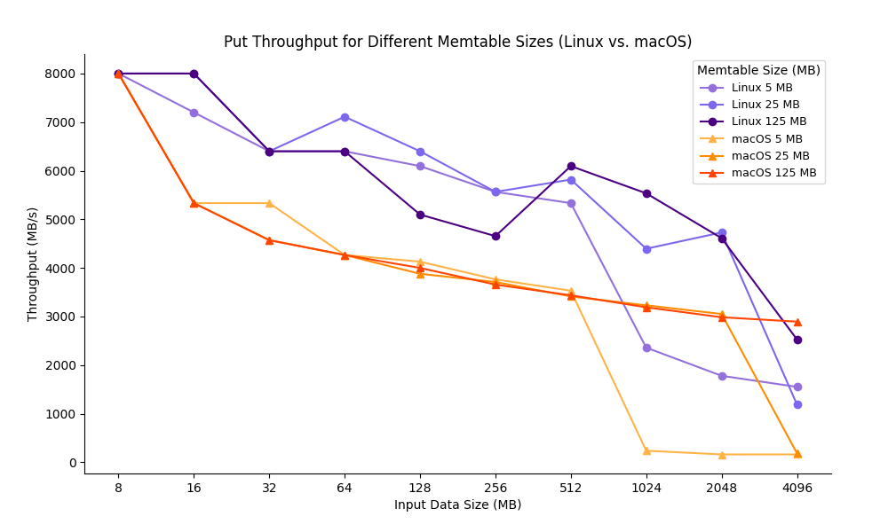
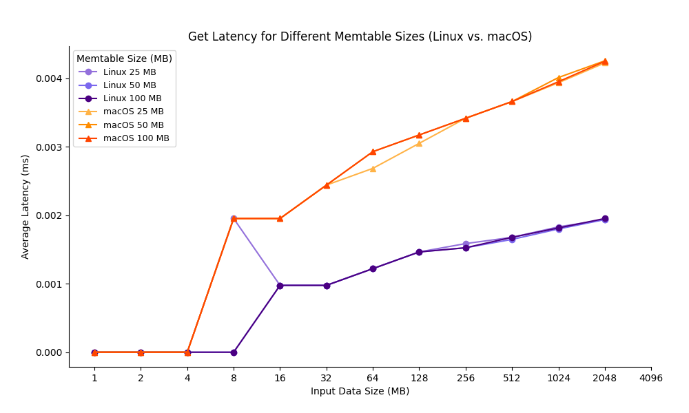
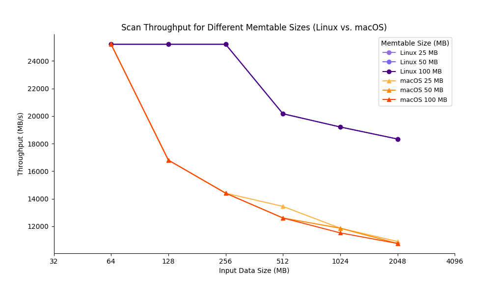

### Benchmark

#### `VeloxDB::Put` 
**`Put` throughput with different `Memtable` size**
```text
    page size = 4 kb
```


#### `VeloxDB::Get` 
**`Get` latency with different `Memtable` size**
```text
    page size = 4 kb
```


#### `VeloxDB::Scan` 
**`Scan` throughput with different `Memtable` size**
```text
    page size = 4 kb
```



